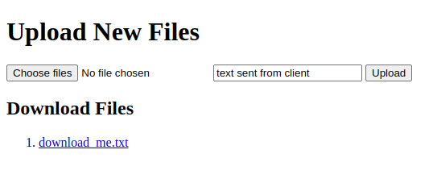

# Local Network based File Transfer

Simple flask based web-app for transferring files over local network.  

### Features
1. Client can connect to server over local network (ip address printed on terminal and also displayed as QR code)
2. Client can upload files (stored in uploads folder)
3. Client can download files on server (files in downloads folder are listed for client)
4. Client can fill and send text (text content stored as a file in uploads folder)

To run simply execute `python app.py`

